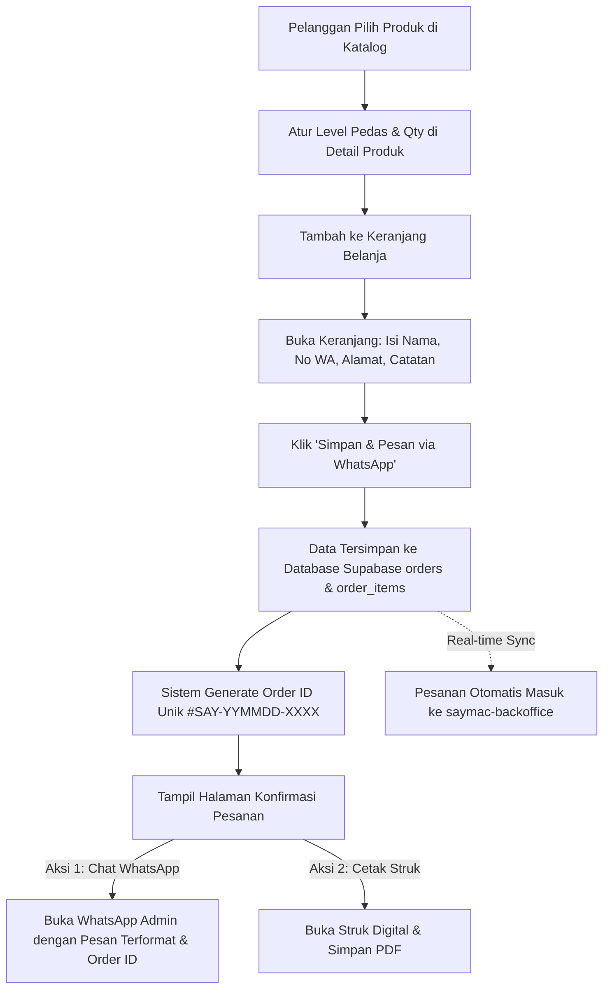

# Product Requirements Document (PRD)
# Website Profiling & Katalog Produk — Say Macaroni

**Versi:** 1.4  
**Status:** Terimplementasi / Siap Produksi (Customer Flow & Order Logging Terintegrasi Backoffice)  
**Terakhir Diperbarui:** 29 Agustus 2026  
**Dokumen untuk:** Tim Development, Product Owner, & Stakeholder Say Macaroni  

---

## 1. Latar Belakang & Deskripsi Produk

**Say Macaroni** adalah brand makanan ringan makaroni goreng khas dengan aneka varian rasa gurih-lezat (Garlic Butter, Original Classic, Balado Daun Jeruk, Keju Premium, Salted Egg) dan tingkatan level kepedasan berjenjang (Level 0–5). 

Aplikasi **Say Macaroni Web** (`saymac-web`) dibangun sebagai website profiling brand sekaligus etalase katalog pemesanan digital modern yang fokus murni pada **pengalaman pelanggan (Customer Experience)**. Website ini memungkinkan calon pembeli menjelajahi varian produk, memilih level pedas dengan penyesuaian harga dinamis (*dynamic pricing*), mengelola keranjang belanja lokal (*client-side cart*), dan melakukan pemesanan instan.

Setiap pesanan yang dibuat pelanggan secara otomatis dicatat ke database Supabase (`orders` & `order_items`) dengan kode unik (*Order ID*), diteruskan ke WhatsApp Admin resmi untuk konfirmasi pembayaran & ongkir, dan dapat langsung dicetak sebagai **Struk Digital / Invoice PDF** oleh pelanggan sebagai bukti pembelian. Seluruh antrean pesanan masuk tersebut secara *real-time* diproses dan dikelola oleh tim admin melalui aplikasi **Say Macaroni Backoffice (`saymac-backoffice`)**.

---

## 2. Tujuan Produk (Product Goals)

1. **Etalase Digital Resmi & Kredibilitas**: Menyediakan katalog online interaktif dengan branding visual premium (*rich aesthetics*, mode gelap/terang, tipografi modern, dan animasi halus).
2. **Pencatatan Pesanan Otomatis ke Database**: Menyimpan setiap transaksi ke tabel `orders` & `order_items` di Supabase secara real-time dengan cadangan offline (*local storage fallback*).
3. **Pemesanan Mudah & Terintegrasi WhatsApp**: Mengotomatisasi perincian pesanan (Kode Order, varian, level pedas, kuantitas, harga, total, dan data penerima) langsung ke nomor WhatsApp Admin resmi via URL deep linking (`wa.me`).
4. **Cetak Struk Digital Pelanggan (PDF)**: Menyediakan bukti struk transaksi digital yang dapat dicetak atau disimpan langsung sebagai file PDF dari browser oleh pelanggan.
5. **Dynamic Level Pricing & Sinkronisasi Konten Toko**: Mendukung harga dinamis per level pedas, banner promo musiman (`campaigns`), dan kontak toko dinamis (`store_settings`) dari Supabase.
6. **Pemisahan Peran Bersih**: Menjaga website publik tetap ringan, cepat, dan fokus pada konversi pembeli, sementara seluruh urusan administrasi dan rekapitulasi data dikelola secara terpusat di `saymac-backoffice`.

---

## 3. Target Pengguna (Target Audience)

- **Konsumen Akhir (Retail):** Penggemar camilan makaroni yang ingin membeli untuk konsumsi pribadi, keluarga, atau hampers momen spesial (Ramadhan/Lebaran) serta menginginkan kemudahan checkout dan bukti struk pesanan digital.
- **Reseller / Calon Mitra Bisnis:** Pihak yang ingin menghubungi admin toko untuk kemitraan melalui tautan WhatsApp resmi yang selalu aktif.

---

## 4. Ruang Lingkup & Status Fitur (Scope & Status)

### 4.1 Modul Pengguna (saymac-web)

| Modul / Fitur | Deskripsi | Status |
|---|---|:---:|
| **Landing Page (Home)** | Hero section dengan CTA interaktif, highlight keunggulan brand, banner promo musiman terintegrasi DB (`campaigns`), dan grid produk unggulan (*featured*). | ✅ Selesai |
| **Katalog Produk (Catalog)** | Grid produk dengan pencarian real-time (nama/deskripsi/rasa), filter kategori (*Best Seller, Classic, Spicy Fusion, Cheese Lover, Specialty*), dan filter tingkat kepedasan (*Tanpa Pedas, Level 1–3, Level 4–5*). | ✅ Selesai |
| **Detail Produk & Pricing** | Galeri foto, informasi komposisi/berat, selektor level pedas interaktif (0–5) dengan update harga instan, *quantity stepper*, rekomendasi produk terkait, dan notifikasi tambah ke keranjang. | ✅ Selesai |
| **Keranjang Belanja (Cart)** | Manajemen cart di sisi client (`localStorage`), kalkulasi subtotal & total otomatis, form data pembeli (Nama, No. WhatsApp, Alamat, Catatan). | ✅ Selesai |
| **Database Order Logging** | Penyimpanan instan data transaksi ke tabel `orders` & `order_items` di Supabase dengan pembuatan Kode Pesanan unik (`#SAY-YYMMDD-XXXX`). | ✅ Selesai |
| **Konfirmasi & WA Dispatch** | Halaman/modal sukses checkout dengan tombol langsung ke WhatsApp Admin membawa Kode Pesanan dan rincian lengkap. | ✅ Selesai |
| **Cetak Struk PDF (Customer)** | Tombol di halaman sukses bagi pelanggan untuk melihat pratinjau dan mencetak/menyimpan struk digital ke PDF. | ✅ Selesai |
| **Halaman Profil (About)** | Cerita brand, nilai keunggulan (Kriuk Maksimal, Bumbu Premium, Halal & Higienis), sertifikasi, dan komitmen kualitas. | ✅ Selesai |
| **Halaman Kontak (Contact)** | Informasi kontak dinamis (WhatsApp, Instagram, Email, Jam Operasional dari `store_settings`), Google Maps embed, dan form pertanyaan langsung ke WhatsApp. | ✅ Selesai |
| **Theme Switcher** | Dukungan Dark Mode (default) dan Light Mode dengan persistensi preferensi di `localStorage`. | ✅ Selesai |
| **Dynamic SEO Meta** | Modifikasi dinamis `<title>` dan `<meta description>` untuk setiap rute halaman (`useSEO`). | ✅ Selesai |

### 4.2 Integrasi dengan Sistem Backoffice (`saymac-backoffice`)

| Fitur Terhubung | Deskripsi | Status |
|---|---|:---:|
| **Sinkronisasi Katalog Produk** | Mengambil produk aktif dan matriks level prices dari tabel `products` Supabase yang dikelola tim backoffice. | ✅ Selesai |
| **Sinkronisasi Promo Musiman** | Menampilkan banner kampanye dari tabel `campaigns` yang diaktifkan melalui backoffice. | ✅ Selesai |
| **Sinkronisasi Kontak Toko** | Mengambil nomor WhatsApp tujuan checkout dari tabel `store_settings`. | ✅ Selesai |
| **Penyaluran Pesanan ke Backoffice** | Setiap order pelanggan langsung masuk ke tabel `orders` & `order_items` dan dapat diproses di menu *Pesanan Masuk* backoffice. | ✅ Selesai |

---

## 5. Alur Pemesanan Pengguna (Customer Order Flow)



---

## 6. Format Integrasi Pesan WhatsApp

Pesan yang digenerate oleh sistem pada halaman Keranjang (`Cart.jsx`) dirancang terstruktur dan diarahkan ke nomor `whatsapp_number` dari `store_settings`:

```text
Halo Say Macaroni, saya ingin mengonfirmasi pesanan saya:

*KODE PESANAN: #SAY-260828-A7K2*

1. Say Macaroni - Garlic Butter (Level Pedas 2) x2 = Rp 52.000
2. Say Macaroni - Balado Daun Jeruk (Level Pedas 4) x1 = Rp 29.000
3. Say Macaroni - Original Classic (Tanpa Pedas) x1 = Rp 22.000

*Total Estimasi: Rp 103.000*

*Data Pemesan:*
- Nama: Budi Santoso
- No. WhatsApp: 081234567890
- Alamat: Jl. Melati No. 12, Kebayoran Baru, Jakarta Selatan
- Catatan: Tolong bumbu daun jeruknya dibanyakin ya kak.

Mohon info ongkir dan petunjuk pembayarannya. Terima kasih!
```

---

## 7. Skema Data Database (Supabase Schema)

### 7.1 Tabel Pesanan (`public.orders`)
```sql
CREATE TABLE public.orders (
  id UUID DEFAULT gen_random_uuid() PRIMARY KEY,
  order_code TEXT UNIQUE NOT NULL,
  customer_name TEXT NOT NULL,
  customer_phone TEXT NOT NULL,
  customer_address TEXT,
  customer_notes TEXT,
  total_amount NUMERIC NOT NULL DEFAULT 0,
  status TEXT NOT NULL DEFAULT 'pending' CHECK (status IN ('pending', 'processing', 'completed', 'cancelled')),
  payment_status TEXT NOT NULL DEFAULT 'unpaid' CHECK (payment_status IN ('unpaid', 'paid')),
  created_at TIMESTAMPTZ DEFAULT now(),
  updated_at TIMESTAMPTZ DEFAULT now()
);
```

### 7.2 Tabel Item Pesanan (`public.order_items`)
```sql
CREATE TABLE public.order_items (
  id UUID DEFAULT gen_random_uuid() PRIMARY KEY,
  order_id UUID NOT NULL REFERENCES public.orders(id) ON DELETE CASCADE,
  product_id TEXT,
  product_name TEXT NOT NULL,
  spicy_level INT2 DEFAULT 0,
  price NUMERIC NOT NULL DEFAULT 0,
  quantity INT4 NOT NULL DEFAULT 1,
  subtotal NUMERIC NOT NULL DEFAULT 0,
  weight TEXT DEFAULT '150g',
  created_at TIMESTAMPTZ DEFAULT now()
);
```

---

## 8. Tech Stack

- **Core:** React 18, Vite (Fast Bundler & HMR)
- **Styling:** Pure Vanilla CSS (`src/index.css`) dengan CSS Variables, Design Tokens, Glassmorphism, dan `@media print` untuk Struk PDF Pelanggan
- **Icons:** `lucide-react`
- **Database / Backend:** Supabase (PostgreSQL, Row Level Security, Storage Bucket)
- **State Management:** React Context API (`CartContext.jsx`) + `localStorage`
- **Deployment Platform:** Vercel

---

*Dokumen PRD ini telah diselaraskan dengan implementasi fitur terkini pada repositori `saymac-web` dan `saymac-backoffice`.*
